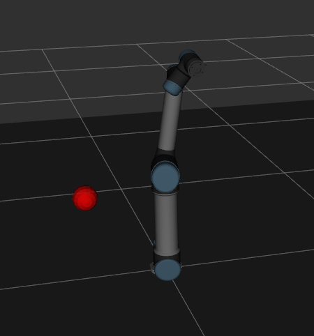

# UR5 Arm - Reinforcement Learning x Inverse Kinematics

This project explores the use of Reinforcement Learning versus Inverse Kinematics for controlling a UR5 robotic arm in a ROS 2-based application. It provides a fully Dockerized environment, enabling easy deployment and experimentation with ROS 2 Jazzy. The goal is to compare the performance, flexibility, and practicality of each control strategy in a realistic robotic scenario.

## Prerequisites

- **Docker**: Ensure Docker is installed and running on your system. You can install Docker by following the instructions at [docker.com](https://www.docker.com/).
- **Supported ROS 2 Distributions**: This container has been tested with the following ROS 2 distributions:
  - `jazzy`

## Development

### Setup URSim for simulation with docker

The documentation for this steps are on: [reference](https://docs.universal-robots.com/Universal_Robots_ROS2_Documentation/doc/ur_client_library/doc/setup/ursim_docker.html).

In an separated secondary terminal, we will create a dedicated docker network.

```bash
docker network create --subnet=192.168.56.0/24 --driver bridge ursim-net
```

Start URSim Container

```bash
docker run --rm -it \
  --name ursim \
  --net ursim-net \
  --ip 192.168.56.101 \
  -v ${HOME}/.ursim/programs:/ursim/programs \
  -v ${HOME}/.ursim/urcaps:/urcaps \
  universalrobots/ursim_e-series
```

to open other terminal:

```bash
docker exec -it ur_ros2_dev_jazzy bash
```

### Building the Docker Container for development

To build the Docker container, use the `build_container.sh` script.

```bash
cd deployment
bash build_container.sh
```

Once the container is built, you can run it using the run_container.sh script.

```bash
bash run_container.sh
```

to open other terminal:

```bash
docker exec -it ur_ros2_dev_jazzy bash
```

## How to build and run code:

### With docker container:

Inside the container:

```bash
colcon build --base-path src
source install/setup.bash
```

### Local Setup

```bash
rosdep init
rosdep update
rosdep install --from-paths src/
```

### Building the Workspace

```bash
python3 -m venv env
source env/bin/activate
colcon build --base-path src
```

## Working

## New terminal setup

Remember to always source when using a new terminal (on container or not):

```bash
source install/setup.bash
```

### Inverse kinematics

Our IK motion planner implementation can be run by launching the simulation and the script:

In one terminal:

```bash
ros2 launch gazebo_control ur_sim_control.launch.py
```

In a second separate terminal

```bash
ros2 run ur5_motion_planner ik_motion_planner
```

to send a pose modify the example:

```bash
ros2 topic pub --once /pose_list geometry_msgs/msg/Pose "{
  position: {x: 0.675, y: 0.122, z: 0.3475},
  orientation: {x: 0.0, y: 0.0, z: 0.0, w: 1.0}
}"
```

### Machine Learning

#### Dataset generation

To generate a certain dataset size, we will also start the simulation and the script. The dataset_generator_node will make random movinments to the robot and save the end effector position and the angles that made the moviments.

In one terminal:

```bash
ros2 launch gazebo_control ur_sim_control.launch.py
```

In a second separate terminal:

```bash
ros2 run ur5_motion_planner dataset_generator_node --num-points 10000 --angle-step 45
```

The parameters can be changed accordingly, or left as default (1000 steps and 45 degrees).
Note: the random angle step used in the code will be from [-angle_step, +angle_step].

#### Reinforcement Learning training

To train a custom model, one can change the parameters inside the [config file](src/ur5_motion_planner/config/rl_config.yaml). The default 'total_timesteps' is very large, but can be changed for testing. Also, different STB3 algorithms ad available to be used.

To train the model, we do the same procedure as before to launch the simulation:

```bash
ros2 launch gazebo_control ur_sim_control.launch.py
```

And on another terminal:

```bash
ros2 run ur5_motion_planner env_node
```

To visualize the target marker, you need to activate it on RViz by following the step by step:

- on the bottom left click on add
- select the "By topic" tab
- during training, there will be an option "/target_marker"
- select the "Marker" under it, represented by a a green cube



## Running Validator

To run the validator, you can use the following command:

```bash
ros2 run ur5_motion_planner validator
```

This will start the validator node, which will generate a random pose and check if the solution is valid. The validator will output the results to the console and log the results to a file.
